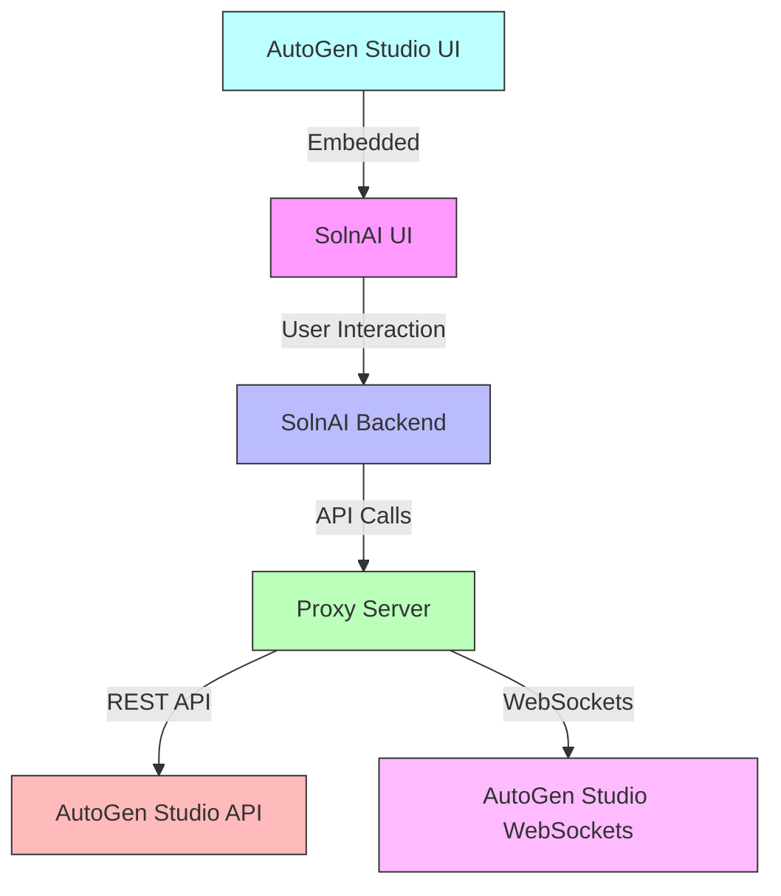
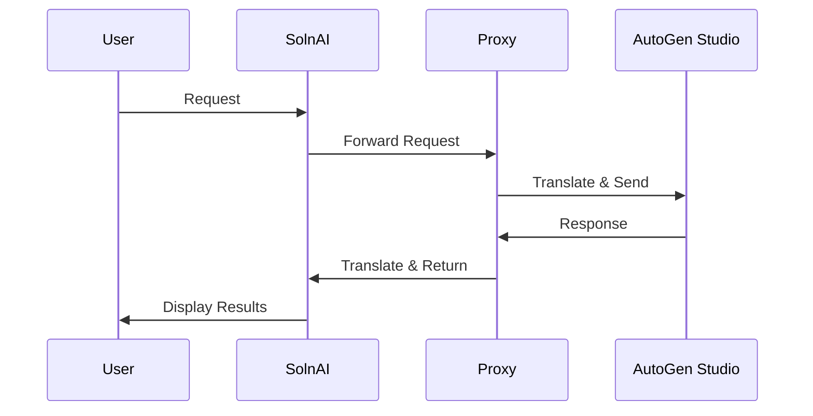

# Architecture for SolnAI-AutoGen Integration

## Status: Draft

## Technical Summary

This architecture defines a bidirectional integration between SolnAI and AutoGen Studio, enabling seamless data exchange and unified user experience. The system employs a modular approach with a proxy server facilitating communication between the two platforms. The architecture ensures secure, efficient data exchange while maintaining the independent functionality of both platforms.

## Technology Table

| Technology | Description |
| ---------- | ----------- |
| TypeScript | Primary language for frontend and backend services |
| React | Frontend framework for UI components |
| Express.js | Backend framework for proxy server |
| Node.js | Runtime environment for JavaScript services |
| Docker | Containerization for deployment |
| WebSockets | Real-time communication between services |
| REST APIs | HTTP-based communication between services |
| AutoGen Studio | Multi-agent orchestration framework |
| SolnAI | Specialized AI agent platform |
| CSS Modules | Scoped styling for React components |

## Architectural Diagrams





## Data Models and API Specs

### Exchange Format Schema

```typescript
interface ExchangeFormat {
  content: string;
  metadata: {
    source: string;
    timestamp: string;
    resultCount: number;
    [key: string]: any;
  };
}
```

### API Endpoints

```typescript
// SolnAI to AutoGen
async getAutoGenAgents(): Promise<any[]>
async getAutoGenAgent(agentId: string): Promise<any>
async createAutoGenSession(agentId: string, task: string): Promise<any>
async sendAutoGenMessage(sessionId: string, message: string): Promise<any>
async getAutoGenMessages(sessionId: string): Promise<any[]>
async getAutoGenSkills(): Promise<any[]>
async addSkillToAgent(agentId: string, skillId: string): Promise<boolean>

// AutoGen to SolnAI
POST /api/solnai/results
POST /api/solnai/messages
GET /api/solnai/agents
```

## Project Structure

```
/
├── /components
│   ├── /ui
│   │   ├── /agent-ui
│   │   │   ├── /services
│   │   │   │   ├── /api.ts              # Extended API service
│   │   │   │   ├── /agent-exchange.ts   # Data exchange service
│   │   │   │   └── /websocket.ts        # WebSocket service
│   │   │   ├── /hooks
│   │   │   │   └── /useAutoGenStudio.ts # AutoGen Studio hook
│   │   │   ├── /specialized
│   │   │   │   └── /AutoGenIntegrationUI.tsx # Specialized UI
│   │   │   └── /AutoGenStudioPanel.tsx   # Standalone panel
├── /proxy
│   ├── /autogen-proxy.js    # Proxy server implementation
│   ├── /package.json        # Proxy dependencies
│   ├── /.env                # Environment configuration
│   └── /Dockerfile          # Proxy container definition
└── /docs
    ├── /README_AUTOGEN_INTEGRATION.md    # Integration guide
    ├── /AUTOGEN_PROXY_SETUP.md           # Proxy setup guide
    └── /INTEGRATION_EXAMPLE.md           # Example implementations
```

## Change Log

| Change | Story ID | Description |
| ------ | -------- | ----------- |
| Initial Architecture | N/A | Initial system design and documentation |

