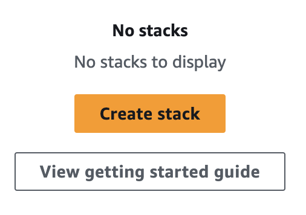
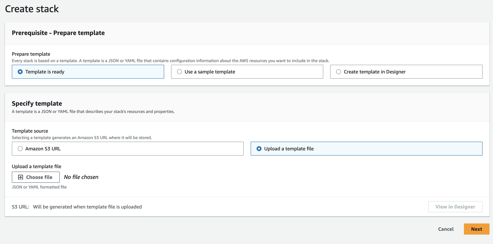
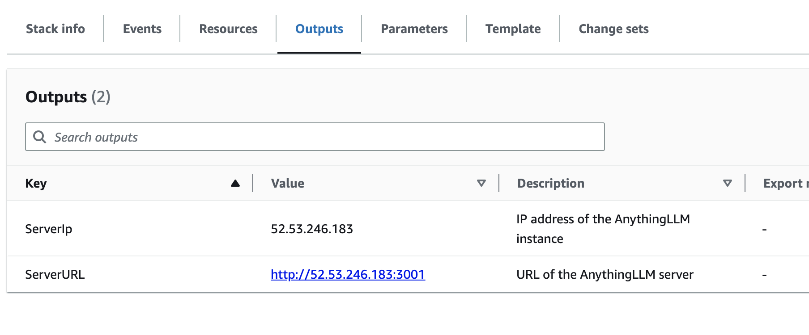

# How to deploy a private SolnAI instance on AWS

With an AWS account you can easily deploy a private SolnAI instance on AWS. This will create a url that you can access from any browser over HTTP (HTTPS not supported). This single instance will run on your own keys and they will not be exposed - however if you want your instance to be protected it is highly recommend that you set a password one setup is complete.

**Quick Launch (EASY)**
1. Log in to your AWS account
2. Open [CloudFormation](https://us-west-1.console.aws.amazon.com/cloudformation/home)
3. Ensure you are deploying in a geographic zone that is nearest to your physical location to reduce latency.
4. Click `Create Stack`



5. Use the file `cloudformation_create_solnai.json` as your JSON template.



6. Click Deploy.  
7. Wait for stack events to finish and be marked as `Completed`
8. View `Outputs` tab.



9. Wait for all resources to be built. Now wait until instance is available on `[InstanceIP]:3001`.
This process may take up to 10 minutes. See **Note** below on how to visualize this process.

The output of this cloudformation stack will be:
- 1 EC2 Instance
- 1 Security Group with 0.0.0.0/0 access on port 3001
- 1 EC2 Instance Volume `gb2` of 10Gib minimum - customizable pre-deploy.

**Requirements**
- An AWS account with billing information.

## Please read this notice before submitting issues about your deployment

**Note:** 
Your instance will not be available instantly. Depending on the instance size you launched with it can take 5-10 minutes to fully boot up.

If you want to check the instance's progress, navigate to [your deployed EC2 instances](https://us-west-1.console.aws.amazon.com/ec2/home) and connect to your instance via SSH in browser.

Once connected run `sudo tail -f /var/log/cloud-init-output.log` and wait for the file to conclude deployment of the docker image.
You should see an output like this
```
[+] Running 2/2
 ⠿ Network docker_solnai  Created 
 ⠿ Container solnai       Started  
```

Additionally, your use of this deployment process means you are responsible for any costs of these AWS resources fully.